

  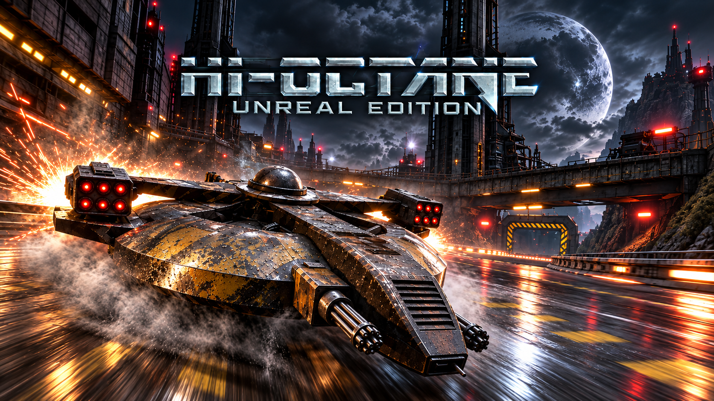

<h1 align="center">Hi-Octane Revived</h1>

  <strong>Bringing the spirit of Hi-Octane to Unreal Engine 5.</strong> 
  Futuristic racing, armed hovercrafts and shifting tracks.

  <strong>IN DEVELOPMENT</strong> &nbsp;·&nbsp; <strong>ORIGINAL &amp; REVIVED</strong> &nbsp;·&nbsp; <strong>PROJECT SHOWCASE</strong>

  <a href="#the-project">The project</a> ·
  <a href="#gameplay">Gameplay</a> ·
  <a href="#two-editions">Two editions</a> ·
  <a href="#original--revived-in-pictures">Screenshots</a> ·
  <a href="#the-revived-vehicles">Vehicles</a> ·
  <a href="#a-vehicle-handling-editor">Tuning editor</a>

---

## The project

**Hi-Octane Revived** is a personal project to bring **Hi-Octane**, the futuristic racing and combat game created by **Bullfrog Productions in 1995**, to **Unreal Engine 5**. Developed by **Arthur Reboul Salze**, it reinterprets the game and its engine to explore how this universe can evolve with modern tools.

The aim is to capture its identity: speed, hovercrafts, firefights, boosts, recharging stations and tracks that transform during a race. Vehicle handling and balance are allowed to evolve, with the focus on the **overall gameplay**, the pace of the race and the driving experience.

### The foundations

The project builds on the original game and on the reconstruction work carried out by **Alexander Wolf** in [**hi-octane202x**](https://github.com/woalexan/hi-octane202x). His C++ recreation is an essential reference for understanding the data formats, the engine and the mechanics of Hi-Octane.

**This project would not have been possible without Alexander Wolf's work.** A huge thank you to him for this foundation and for everything it makes possible to understand and rebuild.

## Gameplay

A look at the project in its current state. Click the image below to watch the gameplay video on YouTube.

  <a href="https://www.youtube.com/watch?v=sEbWAmQ2pUs">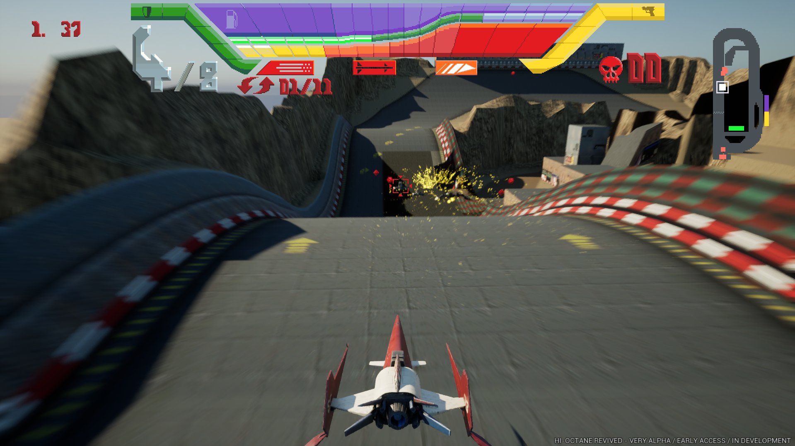</a>

  <a href="https://www.youtube.com/watch?v=sEbWAmQ2pUs"><strong>▶ Watch the gameplay video on YouTube</strong></a>

## Two editions

Two editions have been developed in Unreal Engine. Each has its own assets and settings, with a shared welcome screen to choose the experience.

| | **Original** | **Revived** |
| :--- | :--- | :--- |
| **Direction** | An edition closer to the look and experience of the original game. | An update to both the graphics **and** the gameplay. |
| **Presentation** | Tracks, vehicles, menus and HUD that stay close to the original reference. | New vehicle models, PBR materials, redesigned presentation and effects. |
| **Handling** | A starting point informed by the original mechanics and Alexander Wolf's recreation. | Independent settings to develop vehicle handling and balance. |
| **Rendering** | The original visual identity carried into the Unreal port. | Modern Unreal technologies: **Nanite, Lumen, Niagara and Virtual Shadow Maps**. |

> Here, **Original** refers to the more faithful edition of the **Unreal port**. Both columns below show editions of this project.

## What has been built so far

- **All six tracks**, reconstructed from their data, including terrain, scenery blocks, collisions and track sections that transform.
- **Racing and combat systems**: hovercraft movement, boost, machine guns, guided missiles, targeting, fuel, ammunition, shields, pickups and recharging zones.
- **Race systems**: AI opponents, lap tracking, timers, player records and recovery of stranded or destroyed vehicles.
- **The game interface**: menus, track and vehicle carousels, HUD, several camera views, and control and rendering options.
- **An initial Revived overhaul**: new vehicles, PBR materials, modern lighting, shadows and particle effects.
- **A graphical vehicle handling editor**, to tune vehicles and experiment with the balance of both editions.

### The Revived rendering approach

| Technology | Use in the project |
| :--- | :--- |
| **Nanite** | Virtualized geometry for vehicle models and environment assets in the current working build. |
| **Lumen** | Dynamic global illumination and reflections. |
| **Niagara** | Smoke, fire, explosions and particle effects. |
| **Virtual Shadow Maps** | Dynamic shadows for vehicles and environments. |
| **PBR materials** | Surfaces that respond to light, including metal, paint, roughness and bodywork details. |

The screenshots and video show a **work in progress**. Handling, balance and visual polish continue to evolve.

## Original / Revived in pictures

Four pairs of screenshots showing the two directions of the project. Click any image to open it at full size.

<table>
  <thead>
    <tr>
      <th width="50%" align="center">ORIGINAL</th>
      <th width="50%" align="center">REVIVED</th>
    </tr>
  </thead>
  <tbody>
    <tr><td colspan="2" align="center"><strong>Main menu</strong></td></tr>
    <tr>
      <td><a href="media/01.png">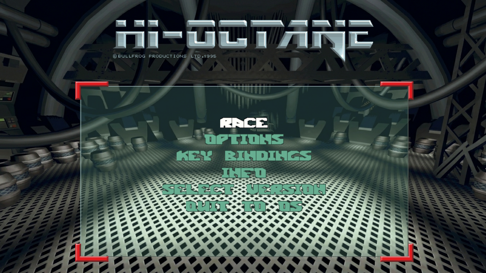</a></td>
      <td><a href="media/02.png">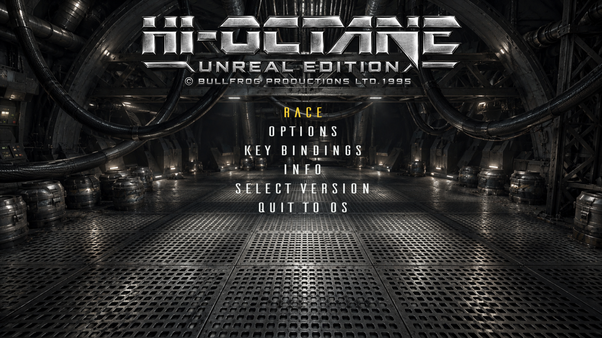</a></td>
    </tr>
    <tr><td colspan="2" align="center"><strong>Track selection</strong></td></tr>
    <tr>
      <td><a href="media/03.png">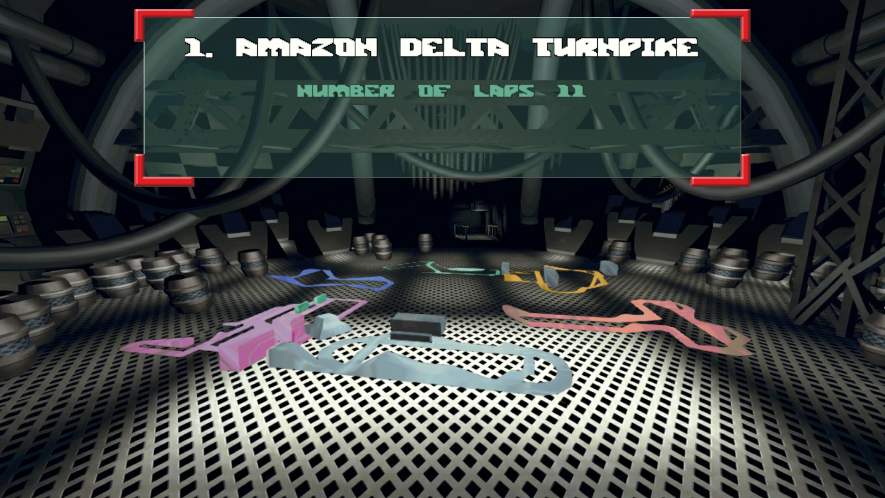</a></td>
      <td><a href="media/04.png">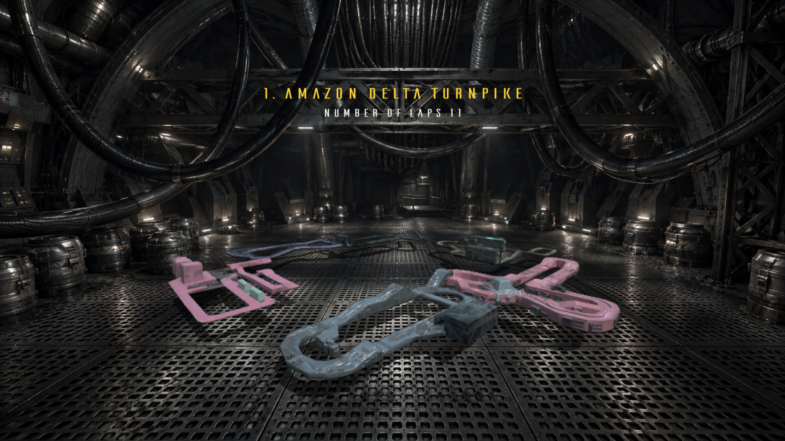</a></td>
    </tr>
    <tr><td colspan="2" align="center"><strong>Vehicle selection</strong></td></tr>
    <tr>
      <td><a href="media/05.png">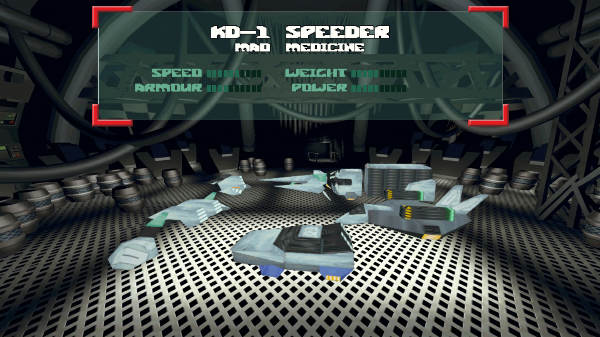</a></td>
      <td><a href="media/06.png">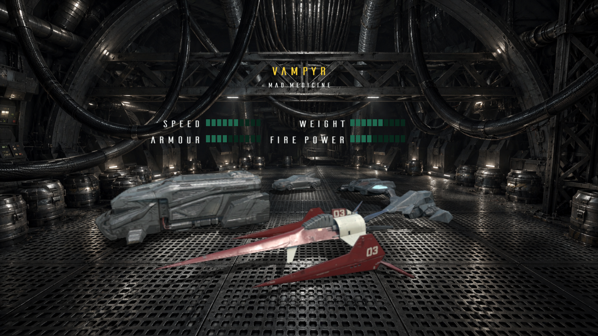</a></td>
    </tr>
    <tr><td colspan="2" align="center"><strong>On the track</strong></td></tr>
    <tr>
      <td><a href="media/07.png">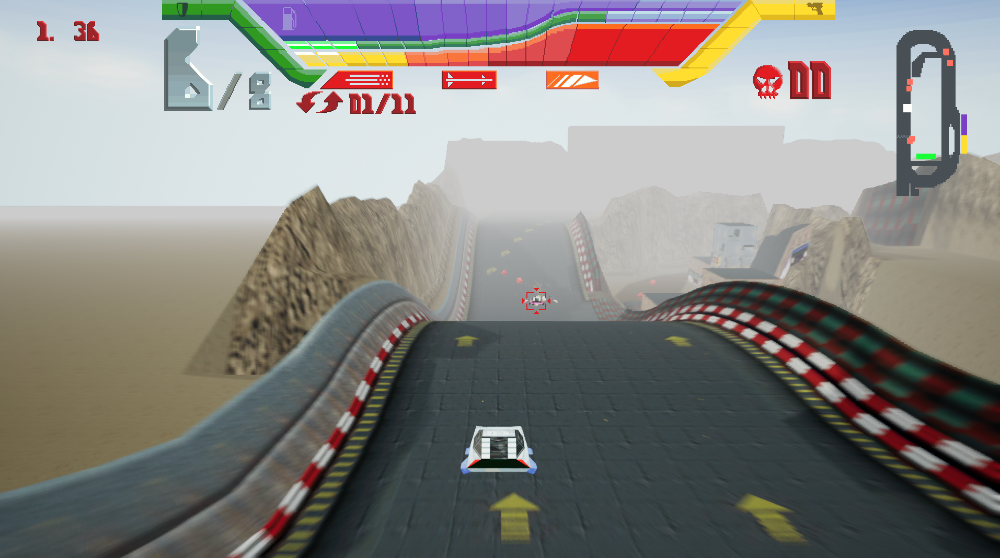</a></td>
      <td></td>
    </tr>
  </tbody>
</table>

## The Revived vehicles

The current 3D models reinterpret Hi-Octane's racing vehicles and recovery craft with more detail and materials suited to modern rendering.

These are **AI generated prototype models**. They are **not optimized** and currently serve as a visual starting point for development. Ideally, they should be rebuilt with clean geometry and proper optimization for use in the game.

<table>
  <tbody>
    <tr>
      <td width="50%" align="center"><a href="media/a.png">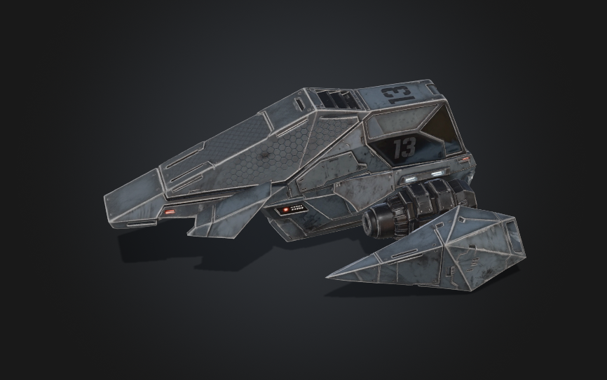</a> <strong>KD-1 SPEEDER</strong></td>
      <td width="50%" align="center"><a href="media/b.png">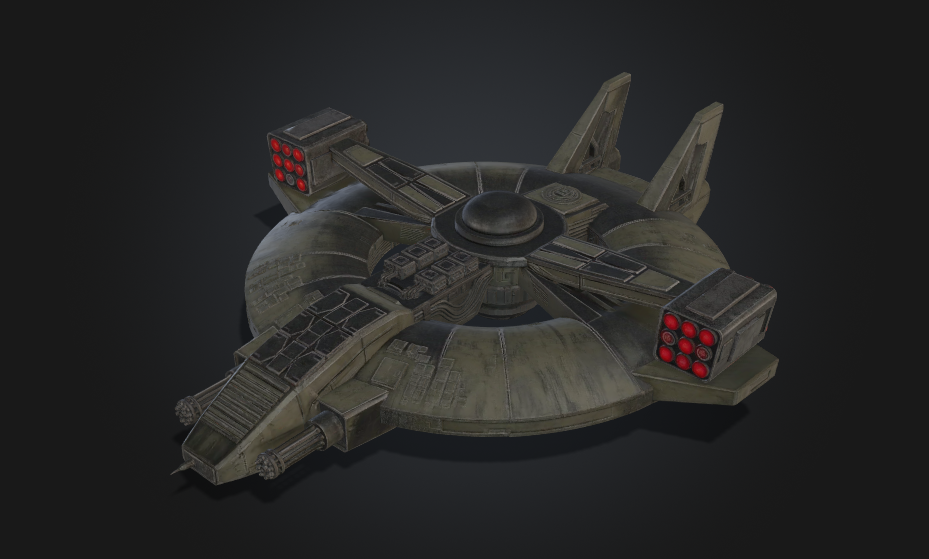</a> <strong>BESERKER</strong></td>
    </tr>
    <tr>
      <td align="center"><a href="media/c.png">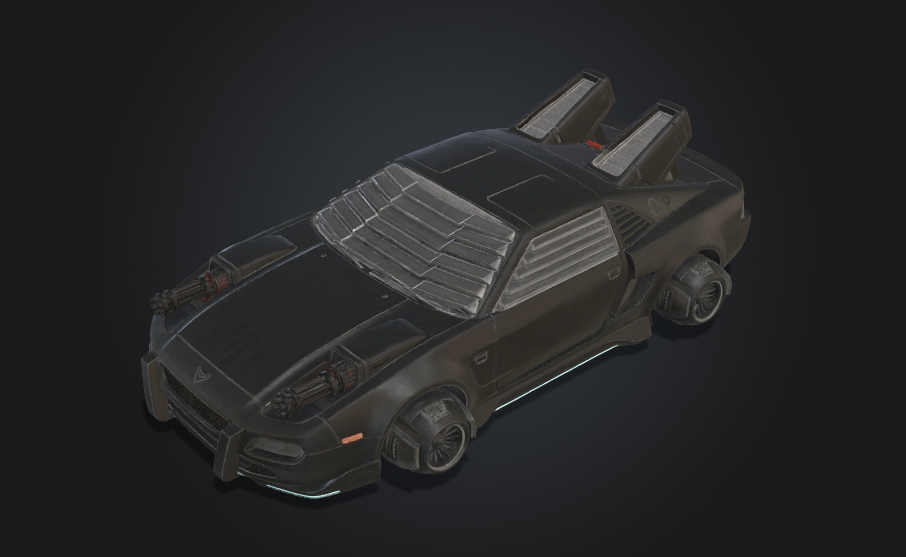</a> <strong>OUTRIDER</strong></td>
      <td align="center"><a href="media/d.png">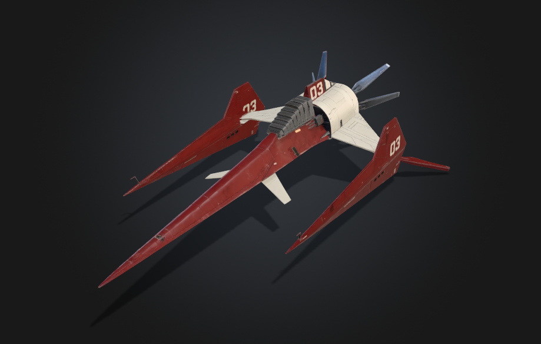</a> <strong>VAMPYR</strong></td>
    </tr>
    <tr>
      <td align="center"><a href="media/e.png">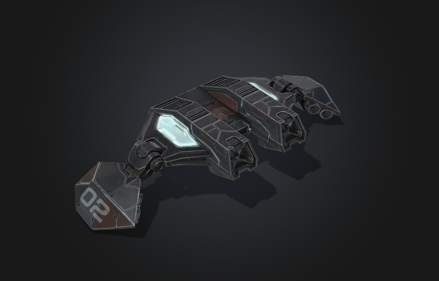</a> <strong>FLEXIWING</strong></td>
      <td align="center"><a href="media/g.png">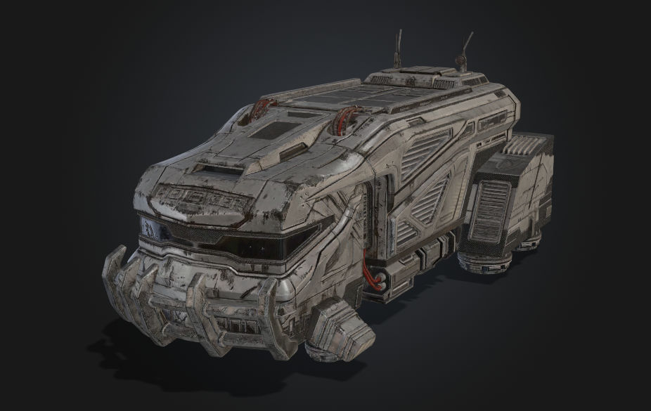</a> <strong>JUGGA</strong></td>
    </tr>
    <tr>
      <td align="center"><a href="media/f.png">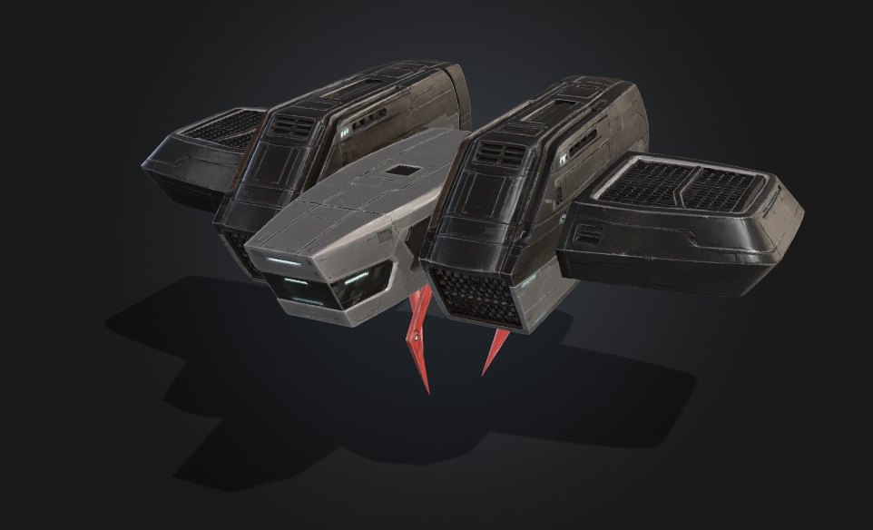</a> <strong>RECOVERY VEHICLE</strong></td>
      <td></td>
    </tr>
  </tbody>
</table>

## A vehicle handling editor

A dedicated graphical tool, **Hi-Octane — Vehicle Tuning**, lets you adjust global parameters and individual vehicle settings, with separate profiles for **Original** and **Revived**.

It supports tuning speed, thrust, acceleration, grip, steering, damage, ammunition costs, missile lock speed and range, hover height and weapon firing points. Profiles can be saved, loaded and shared; changes take effect when the next race starts.

This editor supports the project's approach: experimenting with handling and balance to give each vehicle its own place in the racing experience.

  <a href="media/Editor.png">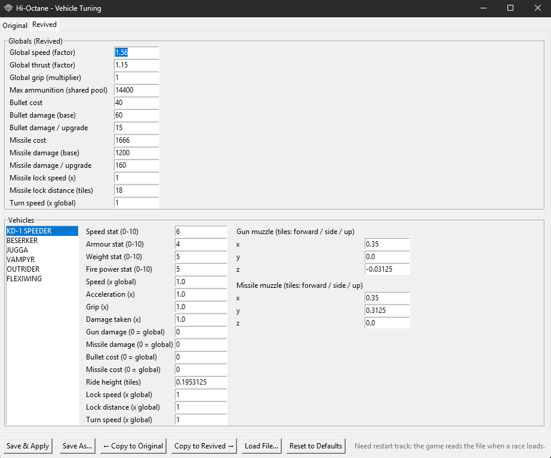</a>

## Where the project is heading

The goal is to develop **Revived** into a more complete modern interpretation of Hi-Octane, with a richer visual identity and progressively refined gameplay.

- Strengthen the driving experience and the personality of each vehicle.
- Completely remake all maps for the **Revived** edition.
- Work towards clean, optimized replacements for the provisional AI generated vehicle models.
- Refine the balance between racing, combat, boost and resource management.
- Add **multiplayer** and **local split screen** in future iterations.
- Continue developing the environments, effects, interface and sound.
- Improve stability and polish through testing in the game.

## About this repository

For now, this repository is a **project showcase**: a presentation, screenshots and vehicle artwork. **No game source code or playable builds are published here.**

**A first playable version of the game will be released soon.**

**Credits** — Hi-Octane: Bullfrog Productions / Electronic Arts. C++ reconstruction and reference: [Alexander Wolf — hi-octane202x](https://github.com/woalexan/hi-octane202x). Unreal port, project direction and Revived asset integration: Arthur Reboul Salze.

Unofficial personal project. Hi-Octane and the original game's material remain the property of their respective rights holders.
